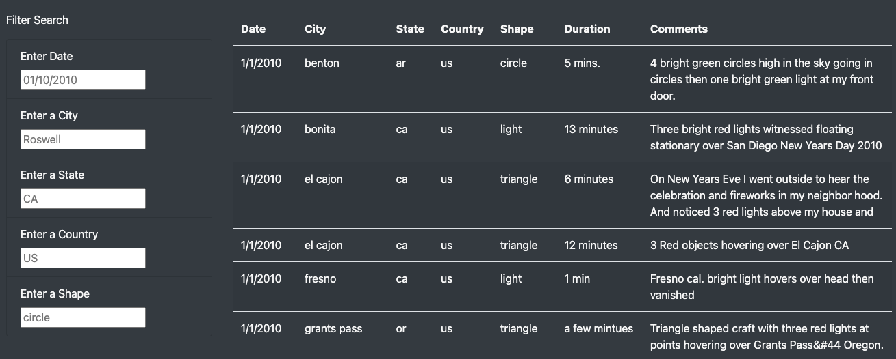
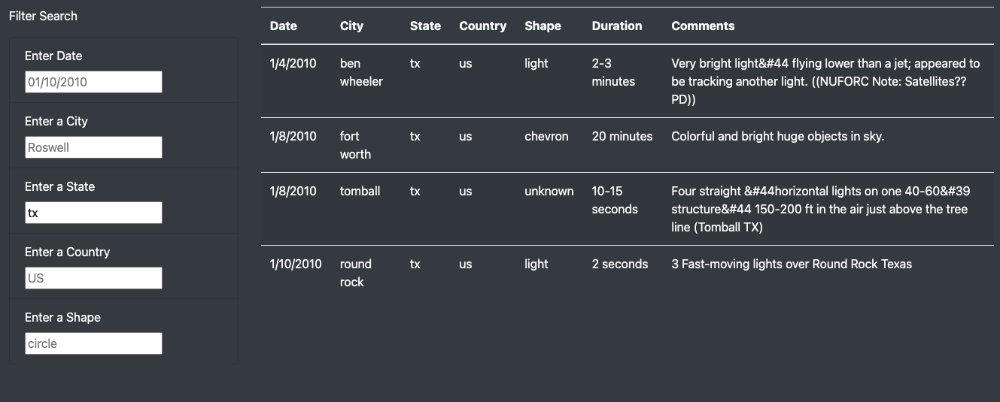
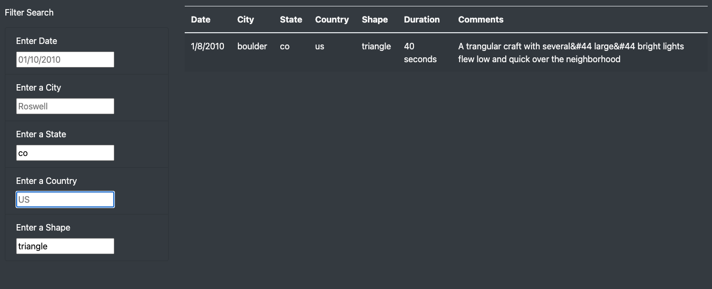

# 11 - UFOs

## Overview
We created a website using bootstrap to browse UFO sighting data from a JavaScript file. The data can be filtered using up to 5 different search criteria.

## Search Results
### Default Display


### One Filter


### Multiple Filters


## Looking Forward
### Additional Site Functionality
We could add a way for users to favorite search results to increase interaction with the page and increase site use. 

It may be useful to add a section of the site that discusses different types of sightings, breaks down various UFO classifications, etc. or even links to photos and additional information about more famous sightings when available. 

### Improving the User Experience
The current filter is not intuitive without the "search" button and users may not immediately undertand how to use the form. It may also be better to use a drop-down for fields like "shape" to help guide users to better use the data filters.

The current layout of the page does not utilize the bootstrap grid system to create an aesthetically appealing layout. It would be better to use a 9+3 layout for the article at the top to mirror the 3+9 layout for the UFO sighting data table. 

The call to action is not obvious because it is at the bottom of a block of text that users are unlikely to read and has no visual differentiation between the regular text. Setting the call to action to interact with the UFO data apart from the rest of the text would tell users what the table is as well as create some visual space between the paragraphs of text at the top of the page and the table of data.

It would also be beneficial to create some visual hierarchy between the heading text and paragraph text styles to better utilize the CSS stylesheet:

````
h1 {
    font-size: 36pt;
    font-weight: 900;
    font-color: yellow;
    }
h3 {
    font-size: 25px;
    font-weight: 700;
    font-color: red;
    text-transform: uppercase;
    }
small {
    font-style: oblique;
    }
p,li {
    font-weight: 300;
    line-height: 2.5;
    }
````